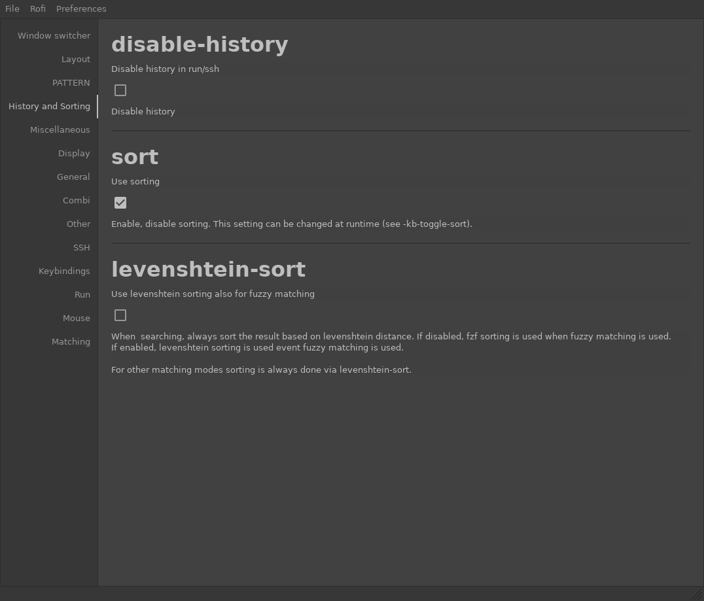

# `wxpy-rofi-config`

 

**NOTE**: The builds use the latest GTK3 wheel and might not test everything to wxPython. They will, however, test everything the app needs (I think).

<!-- MarkdownTOC -->

- [Overview](#overview)
- [Sample](#sample)
- [Links](#links)
- [Roadmap](#roadmap)
    - [Main Features](#mainfeatures)
    - [Eventual features](#eventualfeatures)

<!-- /MarkdownTOC -->

## Overview

I've got a few goals with this project:

1. Test out `wxPython >=4.0`
2. Learn wxWidgets basics
3. Provide a GUI for `rofi` config

At the moment, I'm able to

* load `rofi`'s default and current configs
* provide a tabbed interface with settings
* include inline documentation
* save a rudimentary config file in an easy location

## Sample

I'm using [vanilla Equilux](https://github.com/ddnexus/equilux-theme). It uses native bindings so it should theme like your OS.

## Links

* [`rofi`](https://github.com/DaveDavenport/rofi)
* [`wxPython`](https://www.wxpython.org/)

## Roadmap

These percentages are pretty arbitrary. Today's 47% could be tomorrow's 90% or vice versa.

### Main Features

Once all of these are finished, I'll release `v1`. Until then, `v0` should be used with caution, because it's not stable.

| Progess | Feature |
| ------: | ------- |
|    100% | Load default `rofi` config |
|    100% | Save default `rofi` config |
|    100% | Load arbitrary `rofi` config |
|    100% | Save arbitrary `rofi` config |
|     13% | Style UI |
|    100% | Backup existing `rofi` config |
|     10% | Validate `rofi` config (before/during/after save) |
|    100% | Only save changed values (i.e. not the original `rofi` default) |
|     90% | Fix sizing glitches (e.g. too much at top of scroll) |
|    100% | Refresh config in place |
|     90% | Launch available modi from app |
|      0% | Provide status bar updates |

### Eventual features

These are things I'd like to add, but probably won't be included in `v1`. If not, they'll most likely constitute one or more minor version increments.

| Progess | Feature |
| ------: | ------- |
|      0% | Publish on PyPi |
|      0% | Improve docs show/hide speed |
|      0% | Enumerate known values (e.g. `location`) |
|      0% | Code known limits (e.g. `columns >= 1`) |
|      0% | Map input bindings |
|      0% | Validate available `modi` |
|      0% | Add `path` type and validate |
|      0% | Reduce levels of data binding |
|      0% | Break status bar into several sections |
